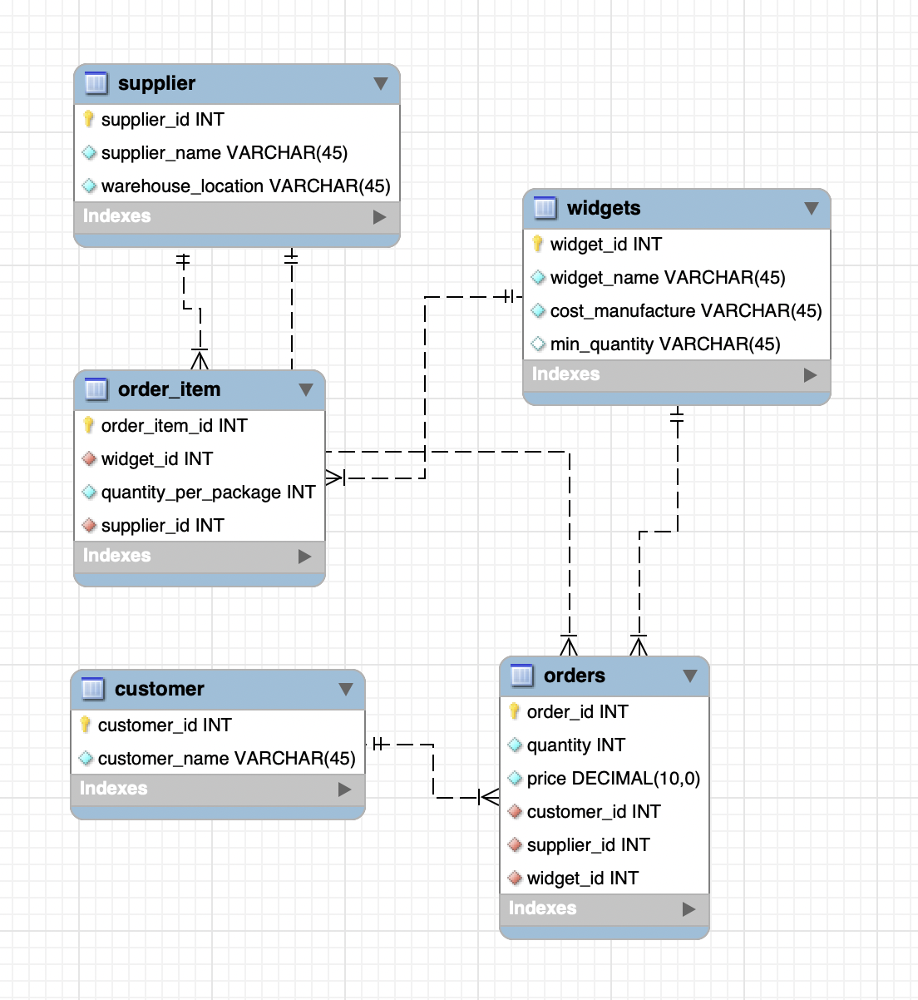

# Widgets System

## Summary of System
Provided in this repo is a `widgets_doc.tsv` containing various information on "widgets." One can deduce that these data are records pertaining to orders of products (called widgets), generally related to animal control and trap-based products for invertebrates and vertebrates alike.

## Description and Application of System
Extrapolating further, these records could be stored in a proper **SQL-language relational database**. Albeit, the data provided are few, you will find a reasonable and fully executable MySQL schema in `widgets_schema.sql`. This system of record-keeping would maintain multiple tables, including foreign keys and cross-referencing tables to reduce data redundancy. Below, you can find the tables listed with their attributes, and a reverse-engineered ER-diagram depicting them.

&nbsp;  

## Widgets Table
| Column | Description|
|-------|---------|
|`widget_id`|ID, primary key|
|`widget_name`|Name of product|
|`cost_manufacture`|Cost to manufacture one widget|
|`min_quantity`|Minimum number of this widget that must be purchased|

&nbsp;  

## Order Item Table
| Column | Description|
|-------|---------|
|`order_item_int`| ID, primary key|
|`widget_id`|Widget, foreign key|
|`quantity_per_package`|Number of widgets in purchasable item|
|`supplier_id`| Supplier, foreign key|

&nbsp;  

## Manufacturer Table
| Column | Description|
|-------|---------|
|`supplier_id`|ID, primary key|
|`supplier_name`|Name of manufacturer|
|`warehouse_location`|Location of manufacturer|

&nbsp;  

## Customer Table
| Column | Description|
|-------|---------|
|`customer_id`|ID, primary key|
|`customer_name`|Name of product buyer|

&nbsp;  

## Orders Table
| Column | Description|
|-------|---------|
|`order_id`|ID, primary key|
|`quantity`|Number of order items bought in order|
|`price`|Total cost of order (as decimal, no currensy denoted in DB|
|`supplier_id`|Manufacturer, foreign key|
|`widget_id`|Widget, foreign key|

&nbsp;  

## ER Diagram

&nbsp;  

&nbsp;  

## Exploring Further
Questions could be answered more thoroughly given further information about this system as a whole. In its current state, the schema only contains one-to-many relationships; if there was a larger subset of orders, could there be a possibility that different suppliers can manufacture the same products? Could Raytheon also produce state-of-the-art ant traps in packages of 10? This would lead to many-to-many relationships between `supplier` and `order_item`. The same principal could be applied to relations between other tables, as well.

&nbsp;  
&nbsp;  

### Justin's Thought of the Day
*I wonder what an elephant trap looks like? I may have to put in an order at Raytheon to find out. Fun fact: I am writing this while visiting my parents, and I can see a Raytheon factory from my backyard.*